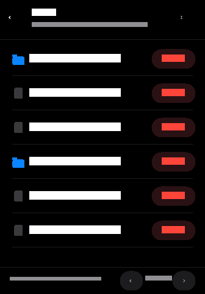

# DEEP_SCAN — 小米手环 9 Pro Lua 表盘（含系统文件管理器）

一款运行在 **小米手环 9 Pro（Vela / MiWear Lua 5.4）** 上的终端风格表盘。
除了常规的时间 / 日期 / 电量 / 步数 / 心率显示外，内置了一个 **系统文件管理器**：

- **深度浏览**：从 `/` 开始逐层进入任意目录，显示目录与文件大小；
- **深度搜索**：在当前目录下递归扫描，按关键字过滤文件名；
- **文件管理**：查看文件信息、**删除文件**（带二次确认弹窗，高危路径强警告）。



## 目录结构

```
lua/                        # 表盘脚本（真机部署时放在 lua/ 目录）
├── main.lua                # 入口：ui.init(style) / pageOnPause / pageOnResume
├── config.lua              # 分辨率、列表上限、搜索限制、高危路径清单
├── theme.lua               # 终端风格配色
├── utils.lua               # 通用工具（Q24.8 解码、路径、格式化）
├── databind.lua            # dataman 订阅封装（数值/字符串、pause/resume）
├── watchface.lua           # 表盘主界面（时间、健康数据、启动文件管理器的入口卡片）
└── filemanager.lua         # 文件管理器（浏览 / 深度搜索 / 删除确认）
bin/DeepScan.face           # 已构建的实机安装包（产物）
bin/resource.bin            # 模拟器/LuaDevTemplate 安装副本
watchface.config.json       # LuaDevTemplate 兼容的项目配置（projectName/watchfaceId）
watchface/fprj/DeepScan.fprj# 表盘项目元数据（XML）
watchface/fprj/images/preview.png  # 表盘预览图（可用脚本重新生成）
scripts/face-lib.mjs        # .face 容器格式库（构建/解析共用）
scripts/build-face.mjs      # 打包器：lua/ → bin/*.face（含自校验）
scripts/unpack-face.mjs     # 解包/校验器：.face → 记录清单/文件
scripts/smoke-test.lua      # Lua 冒烟测试（打桩 lvgl/dataman，桌面 Lua 5.4 可跑）
scripts/gen-preview.mjs     # 预览图生成脚本（纯 Node，无依赖）
```

## 功能说明

### 表盘主界面
- 大号时钟（HH:MM）+ 秒 + 星期 + 日期；
- 顶部电量（充电时显示 `CHG`）；
- 底部终端卡片显示步数、心率（心率 >100 变黄、>140 变红）、文件系统状态；
- **点按终端卡片** 进入文件管理器；文件管理器内点 `<` 回到表盘（在 `/` 根目录时）。

### 文件管理器
| 操作 | 说明 |
| --- | --- |
| `<` 返回 | 浏览模式下进入上一级目录；在根目录时返回表盘；搜索模式下退出搜索 |
| `/` 按钮 | 回到根目录 |
| 点目录行 | 进入该目录 |
| 点文件行 | 弹出详情：文件名、完整路径、大小、**删除**按钮 |
| 长按目录行 | 直接弹出该目录的删除确认（删除空目录） |
| 搜索框 | 点击弹出键盘输入关键字，对当前目录**递归深度扫描**，列出匹配项 |
| 删除确认 | 二次确认弹窗；匹配 `config.DANGER_PREFIXES` 的路径会显示红色强警告 |

### 深度搜索
- 从当前目录开始递归（默认深度 8 层），按关键字做**不区分大小写的子串匹配**；
- 默认最多返回 60 条、扫描 20,000 个条目，避免长时间阻塞 UI（可在 `config.lua` 调整）；
- 搜索结果的目录项点击后直接跳转进入（回到浏览模式）。

## 打包与安装

本仓库内置一套**无依赖的 Linux/Node 打包工具链**，可直接在终端产出可安装的 `.face`：

```bash
bun scripts/build-face.mjs          # 读 lua/ + watchface.config.json，输出 bin/DeepScan.face
bun scripts/unpack-face.mjs bin/DeepScan.face   # 校验/解包（验证工具）
lua5.4 scripts/smoke-test.lua       # 冒烟测试（打桩 lvgl/dataman，驱动浏览/搜索/删除）
```

产物：

| 文件 | 说明 |
| --- | --- |
| `bin/DeepScan.face` | 实机安装包（Vela Lua 表盘容器，Lua 源码明文内嵌） |
| `bin/resource.bin` | 同内容的副本，供模拟器/LuaDevTemplate 安装流程使用 |

`.face` 容器格式（Face V2，已按 `m0tral/UnpackMiColorFace` 源码与真实小米手环 9 Pro 样本 `monika_band9Pro.bin` 逐字节验证）：
- **头部（0x00–0x10F）**：`5A A5 34 12` 魔数；0x10=2048；0x1C=1；0x20=预览块偏移；0x28 起 10 字节 ASCII 表盘 ID；0x68 起 UTF-8 标题；0xA8=backImageId(0)、0xAC=previewImageOffset；0xB0–0xFF 为 10 个 8 字节描述符 `[count][offset]`（i=5 指向 Lua 文件表）；0x100 为 element 记录。
- **文件表（TOC，0x110）**：16 字节条目 `[id=(5<<24)|i][0][偏移][长度]`，以 `(5<<24)|0x14` 终止；文件记录 `[u16 长度&0xFFFF][u8 长度>>16][u8 名称长度][16B 0]` + 名称 + 数据，记录 4 字节对齐。
- **预览块（文件末尾，0x20/0xAC 指向）**：`[rle][type][宽 u16][高 u16][dataLen][magic 0x5AA521E0][compressType=(w×h×4)<<4|4]` + RLEv11 压缩的 RGBA 图像（230×328，`0x81` 控制字节的行程编码）。

打包脚本对产物做自解析回读校验（文件表、预览 magic/尺寸、RLE 解压像素数）。

### 在 Windows 上用官方/社区工具链构建（可选）

1. 使用 **LuaDevTemplate**（`github.com/FangAiden/LuaDevTemplate`）：把 `lua/` 下文件放入 `watchface/fprj/app/lua/`，运行任务“构建表盘二进制”，产物在 `bin/`；
2. 或使用 **EasyFace**（`github.com/m0tral/EasyFace`，Windows，支持小米手环 9 Pro）：打开 `watchface/fprj/DeepScan.fprj` → 打包安装；
3. 真机部署目录：`/data/app/watchface/market/<watchfaceId>/lua/`。

> 预览图可用 `bun scripts/gen-preview.mjs`（或 `node`）重新生成。
> `.face` 内嵌的**预览块**（Mi Fitness 表盘列表展示用的缩略图）由打包器自动生成：从 `lua/` 同风格的设计图按 230×328 绘制并 RLEv11 压缩，与官方样本的预览块结构/尺寸/压缩参数一致。这是表盘安装所必需的段，缺失会导致安装器崩溃。

## 系统文件安全说明

- 表盘脚本运行在独立的 Lua 进程内，文件访问受**系统权限与挂载属性**限制：
  - `/data`（YAFFS/FATFS）是可写数据分区，删除通常可行；
  - `/resource`、`/misc`、`/mode`、`/etc`、`/dev` 等分区**只读**，删除会失败并提示 `delete failed`；
- 删除使用 Lua 标准库 `os.remove()`（固件已提供），失败时返回系统错误信息；
- 对系统关键路径（如 `/data/system`、`/data/app/watchface`、`/data/quickapp`、`/resource` 等）会显示 `! SYSTEM PATH` 强警告，但**不阻止**操作——请谨慎使用；
- 删除**非空目录**会失败（`os.remove` 只能删空目录）；
- 不建议在系统服务运行中删除正在使用的数据库/日志文件，可能造成数据不一致。

## 运行环境与 API 说明

| 能力 | 接口 | 备注 |
| --- | --- | --- |
| Lua | 5.4.0 | `//` 等 5.3+ 语法可用 |
| 图形 | `lvgl` | `lvgl.Object/Label/Textarea/Keyboard/Timer` |
| 数据 | `dataman` | 时间/健康/电池，Q24.8 定点（除以 256 解码） |
| 文件 | `lvgl.fs.open_dir/open_file` | 目录 `read/close`，文件 `read/seek/write/close` |
| 删除 | `os.remove` | 标准库（或退回 `lvgl.fs.remove`） |
| 振动 | `vibrator`（可选） | 删除成功时轻振反馈 |

> 字体仅验证了 `montserrat`（拉丁字符集），因此界面文案全部使用英文；
> 中文文件名会原样显示（受字体限制可能无法渲染字形）。
> 相关文档：<https://docs.luoxe.cn/docs/vela/lua/>

## 常见问题

- **时间不刷新**：不同固件的数据源略有差异。本表盘同时订阅了 `timeHourLow/High` 与组合值 `timeHour`（兜底），若仍不刷新请按文档核对数据源名称。
- **搜索键盘不弹出**：部分固件未开放 `lvgl.Keyboard`，此时搜索框保留但无法输入；代码已做降级处理（不报错）。
- **文件删除失败**：多为只读分区或无权限，状态栏会显示系统错误信息。
- **列表卡顿**：可在 `config.lua` 调小 `MAX_LIST_ROWS`（默认 200）与 `SEARCH_SCAN_CAP`（默认 20000）。
